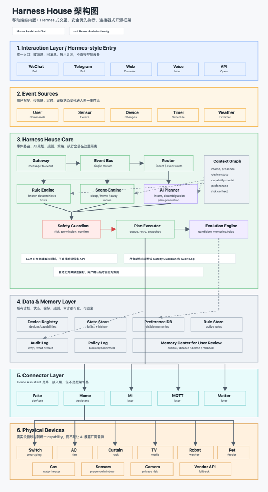
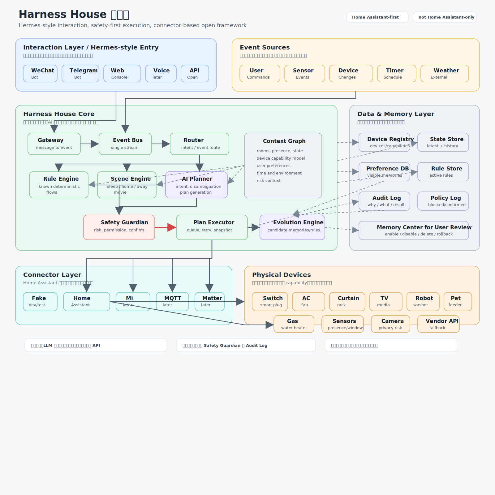
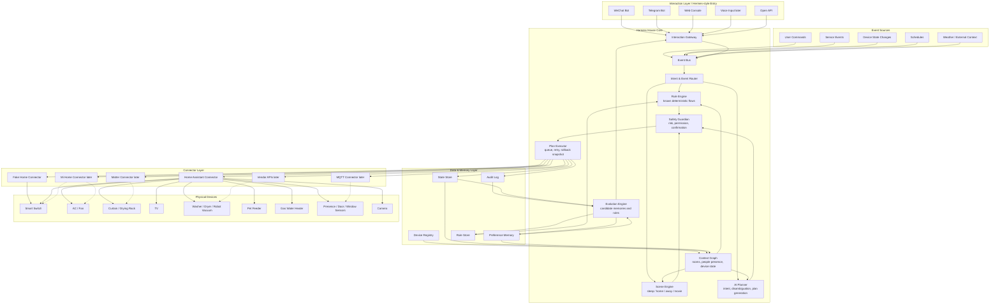
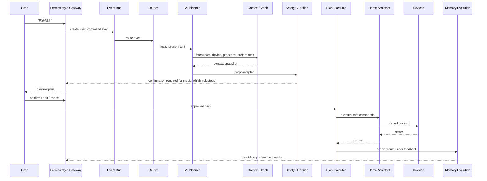
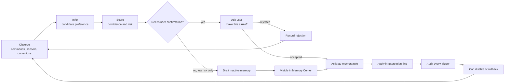

# Harness House Hermes-Inspired Architecture

## 0. 静态架构图

如果 Mermaid 在当前界面不渲染，优先看这张移动端纵向完整 PNG：



也可以直接打开横版 SVG：



## 1. 设计判断

目标是模仿 Hermes 的优点，但不照搬成一个“Agent 独裁式中枢”。

适合保留：

- 统一对话入口：微信、Telegram、Web、语音后续都可以接入。
- Agent 工具调用：自然语言转成结构化意图、计划和工具调用。
- 偏好记忆：让系统逐步适应常住主人。
- 可解释反馈：每次执行后告诉用户做了什么、为什么做。
- 主动建议：在安全范围内，根据上下文提出建议。

需要改造：

- Hermes 式中心 Agent 不应直接控制设备。
- LLM 不应处理所有事件，确定性规则和传感器联动应该走本地规则。
- 自进化不能直接变成自动控制权，必须经过策略、置信度和用户确认。

暂缓或舍弃：

- P0 不做全自动强化学习接管。
- P0 不做复杂多用户画像。
- P0 不做所有厂商原生接入。
- P0 不让 AI 自动操作燃气、门锁、监控隐私相关能力。

一句话：

```text
Hermes 负责“像人一样对话和协调”，Harness House Core 负责“像系统一样安全执行”。
```

## 2. 总体架构图



## 3. 控制流



## 4. 自进化闭环



自进化的边界：

- 可以学习舒适温度、灯光亮度、窗帘位置、扫地避让、常用场景。
- 可以生成候选规则，但默认应让用户确认后生效。
- 不自动学习门锁、燃气、监控隐私、宠物投喂上限这类高风险规则。
- 每条记忆必须有来源、触发次数、最近触发时间、启用状态和删除入口。

## 5. 模块取舍

| Hermes-like 能力 | 是否适配 Harness House | 处理方式 |
| --- | --- | --- |
| 统一聊天入口 | 适配 | 保留，作为 Interaction Gateway |
| Agent 工具调用 | 适配 | 保留，但输出必须是结构化 plan |
| 长期记忆 | 适配 | 保留，但必须可见、可删、可回滚 |
| 主动建议 | 适配 | 保留，P1 开始做 |
| 自动执行 | 部分适配 | 只允许低风险和高置信场景 |
| Agent 直接调设备 API | 不适配 | 禁止，必须经过 Policy 和 Executor |
| 全量事件都进 LLM | 不适配 | 已知规则走 Rule Engine |
| 强化学习自动接管 | P0 不适配 | 先做候选偏好和用户确认，RL 后置 |
| 多用户复杂画像 | P0 不适配 | 后置到 P2 |
| 云端优先 | 不完全适配 | 支持多 provider，本地优先可作为方向 |

## 6. 推荐落地版本

### P0: Framework Skeleton

- `Connector` 接口。
- `Device` / `Capability` schema。
- `Intent` / `Plan` / `Command` schema。
- Fake Home Connector。
- Home Assistant Connector。
- Rule Engine。
- Safety Guardian。
- Audit Log。
- Web Console 或 Bot 入口二选一。

### P1: Hermes-like Agent Experience

- 对话式场景编排。
- 模糊意图消歧。
- 执行计划预览。
- 偏好记忆。
- 记忆中心。
- 主动建议，但不默认执行。

### P2: Open Framework Ecosystem

- Mi Home / MQTT / Matter connectors。
- 多 LLM provider。
- 插件式场景模板。
- 更完整的多用户偏好。
- 本地模型 fallback。
- 可选 RL learner。

## 7. 最终架构原则

```text
对话入口像 Hermes。
执行链路像工业控制系统。
设备接入像开源插件框架。
自进化像可审计的偏好管理，而不是不可控的自动驾驶。
```
