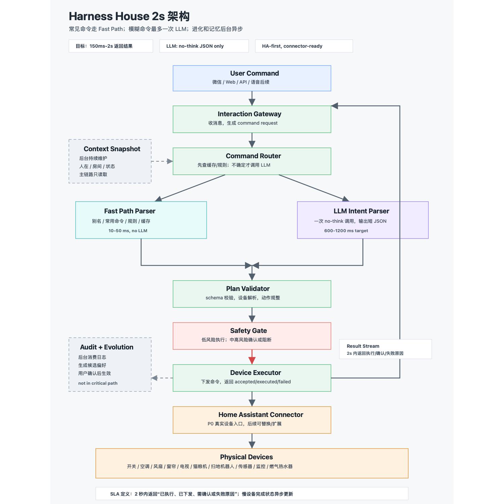

# Harness House 2s Latency-First Architecture

## 1. 目标调整

你希望“一个指令到结果执行”控制在 2 秒左右。这个目标成立，但需要重新定义主链路：

```text
主链路只做：接收指令 -> 理解意图 -> 校验安全 -> 下发命令 -> 返回结果
```

不应该在主链路里做：

- 长链路 Agent 推理。
- 多轮工具调用。
- 实时扫描全屋状态。
- 记忆归纳。
- 自进化规则生成。
- 强化学习更新。
- 多连接器并发探索。

这些都应该放到后台。

核心取舍：

```text
常见命令走 Fast Path。
模糊命令最多走一次 LLM。
复杂命令先返回计划或确认。
自进化完全异步。
```

## 2. 简化架构图



## 3. 简化后的主架构

```text
User
  -> Interaction Gateway
  -> Command Router
      -> Fast Path: alias / rule / command cache
      -> LLM Path: single no-think JSON call
  -> Plan Validator
  -> Safety Gate
  -> Device Executor
  -> Home Assistant Connector
  -> Devices
  -> Result Stream

Audit Log -> Evolution Worker async
State Events -> Context Snapshot async
```

相比上一版，主链路从“多引擎编排”简化成两个路径：

1. Fast Path：无需大模型。
2. LLM Path：最多一次大模型调用。

## 4. 2 秒延迟预算

以“无 think 大模型调用 + 本地 Home Assistant 下发”为目标，建议预算如下：

| 阶段 | 目标耗时 | 说明 |
| --- | ---: | --- |
| 接收消息 | 20-80 ms | Web/Bot/API gateway |
| 读取上下文快照 | 10-30 ms | 必须预计算，不能实时扫设备 |
| 路由判断 | 10-30 ms | 判断是否命中 Fast Path |
| Fast Path 解析 | 10-50 ms | 命令缓存、别名、确定性规则 |
| LLM Path 解析 | 600-1200 ms | 最多一次 JSON 输出，不做长推理 |
| 计划校验 | 10-40 ms | schema validation + device resolve |
| 安全策略 | 10-40 ms | risk / permission / confirmation |
| 命令下发 | 100-500 ms | Home Assistant local API/WebSocket |
| 返回结果 | 20-100 ms | 返回 accepted/executed/needs_confirm |

常见 Fast Path 总耗时：

```text
150-800 ms
```

常见 LLM Path 总耗时：

```text
900-1900 ms
```

这要求 LLM 不进入 tool loop，不要一边想一边查，一次输入拿到结构化 JSON。

## 5. 关键定义：2 秒内返回什么

不同设备不能使用同一个“完成”定义。

| 类型 | 2 秒内返回 | 后续异步 |
| --- | --- | --- |
| 开关、灯、电视 | 已执行或失败 | 状态校准 |
| 空调、风扇 | 命令已下发，状态已更新 | 温度变化 |
| 窗帘、晾衣杆 | 已开始执行 | 到位事件 |
| 扫地机器人 | 已启动/已暂停 | 清扫完成 |
| 洗衣机、烘干机 | 已启动/已暂停，必要时确认 | 洗烘完成 |
| 猫粮机 | 已投喂/需确认 | 投喂记录 |
| 燃气热水器 | 默认返回确认请求 | 不自动执行高风险动作 |
| 监控 | 返回查询/权限结果 | 不做默认隐私分析 |

因此 2 秒 SLA 应该定义为：

```text
用户在 2 秒内收到“执行结果、下发结果、确认请求或失败原因”。
```

不是所有物理设备都在 2 秒内完成动作。

## 6. Fast Path 设计

Fast Path 用来处理高频、低风险、明确的指令。

例子：

```text
关客厅灯
打开书房风扇
卧室空调 25 度
关闭电视
窗帘关上
猫喂了吗
```

Fast Path 数据来源：

- 设备别名表。
- 房间别名表。
- 常用命令模板。
- 用户确认过的偏好规则。
- 最近一次成功 LLM 解析结果的 command cache。

Fast Path 不需要 LLM，只做确定性解析：

```text
normalized_text -> command template -> device resolve -> safety gate -> execute
```

如果置信度不够，才进入 LLM Path。

## 7. LLM Path 设计

LLM Path 只负责“模糊语言 -> 结构化 JSON”，不能直接执行设备。

输入给模型的内容必须短：

- 当前用户原文。
- 当前房间/人在状态。
- 可控设备摘要。
- 相关偏好摘要。
- 输出 schema。

输出必须短：

```json
{
  "intent": "control_device",
  "confidence": 0.86,
  "targets": [
    {
      "room": "study",
      "device_type": "fan"
    }
  ],
  "actions": [
    {
      "capability": "turn_on"
    }
  ],
  "needs_confirmation": false
}
```

禁止：

- 多轮思考。
- 模型自己调用设备 API。
- 模型直接读数据库。
- 模型生成长解释。
- 模型在一次请求里规划太多动作。

## 8. Context Snapshot

为了 2 秒内完成，不能每次用户说话时再去扫全屋设备。

应该后台持续维护一个轻量快照：

```json
{
  "rooms": {
    "study": {
      "presence": true,
      "devices": ["study_light", "study_fan", "study_ac"]
    },
    "kitchen": {
      "presence": false,
      "devices": ["kitchen_light", "kitchen_presence_sensor"]
    }
  },
  "recent_user_location": "study",
  "updated_at": "..."
}
```

主链路只读取快照，不实时刷新。

## 9. 自进化移出主链路

自进化不参与 2 秒主链路。

正确做法：

```text
执行日志 -> 后台 Evolution Worker -> 候选偏好 -> 用户确认 -> 写入规则/记忆
```

例如：

```text
用户连续 5 次把睡眠场景空调改成 25 度
-> 后台发现模式
-> 下次空闲时提示：是否将睡眠空调偏好设为 25 度？
-> 用户确认后写入 Preference DB
```

主链路只读取已经确认过的偏好，不现场学习。

## 10. 对 GPT-5.5/no-think 的使用建议

我不会把具体模型名写死进架构，因为模型延迟会受网络、负载、上下文长度影响。

但如果按你说的“类似当前大模型、不开 think”的速度来设计，那么规则应该是：

1. 每条模糊指令最多一次 LLM 调用。
2. LLM 输出限制在小 JSON，通常不超过 300 tokens。
3. 输入上下文控制在 2-4 KB。
4. LLM 超时建议 1.2-1.5 秒。
5. 超时后不要继续等，返回“正在解析/请确认/改走保守计划”。
6. 低风险常用命令逐步缓存进 Fast Path。

这样即使 LLM 偶尔慢，系统也不会整体卡死。

## 11. P0 推荐架构

P0 只做这些模块：

```text
Interaction Gateway
Command Router
Fast Path Parser
LLM Intent Parser
Plan Validator
Safety Gate
Device Executor
Home Assistant Connector
Context Snapshot
Audit Log
Evolution Worker async
```

暂时不做：

- 完整 Event Bus。
- 复杂 Scene Engine。
- RL Learner。
- 多连接器运行时编排。
- 多用户画像。
- 主动建议实时决策。

这些可以作为 P1/P2。

## 12. 最终建议

如果 2 秒是硬指标，Harness House 的第一版应该叫：

```text
Fast AI Home Control Runtime
```

而不是完整的 autonomous home agent。

一句话版本：

```text
常见命令不用大模型；
模糊命令只用一次大模型；
安全和执行全部用确定性代码；
记忆和进化全部后台异步。
```
